# Alumni Hub - University Alumni Networking Platform

  

A modern, responsive web application for university alumni networking, event management, and mentorship matching. Built with **SolidJS**, **TypeScript**, and **Vite** for blazing-fast performance.

## Table of Contents

- [Features](#features)
- [Tech Stack](#tech-stack)
- [Installation](#installation)
- [Usage](#usage)
- [Demo Credentials](#demo-credentials)
- [Project Structure](#project-structure)
- [Development](#development)
- [Roadmap](#roadmap)
- [Contributing](#contributing)
- [License](#license)

## Features

### Alumni Features
- ✅ User authentication and registration
- ✅ Dashboard with quick action cards
- ✅ Upcoming events browsing
- ✅ Alumni directory with search/filter
- ✅ Mentorship matching system
- ✅ Notification center
- ✅ Personal profile management
- ✅ Event RSVP and check-in

### Admin Features
- ✅ Admin dashboard with analytics
- ✅ Event creation and management
- ✅ Alumni verification queue
- ✅ User management
- ✅ System analytics and reports

## Tech Stack

**Frontend:**
- [SolidJS](https://solidjs.com) - Reactive JavaScript framework
- [TypeScript](https://www.typescriptlang.org/) - Type-safe JavaScript
- [Vite](https://vite.dev) - Next-generation build tool
- Vanilla CSS - Lightweight styling (no frameworks)

**Tools & Development:**
- Git & GitHub
- VS Code with GitHub Copilot
- Node.js v18 LTS

**Deployment Ready:**
- Client-side state management (no backend database required)
- localStorage for data persistence
- Production build optimization with Vite

## UI Showcase

Explore the Alumni Hub interface with screenshots from different sections:

### 1. Events Listing
Browse and search upcoming alumni events including workshops, reunions, and webinars with filtering capabilities.

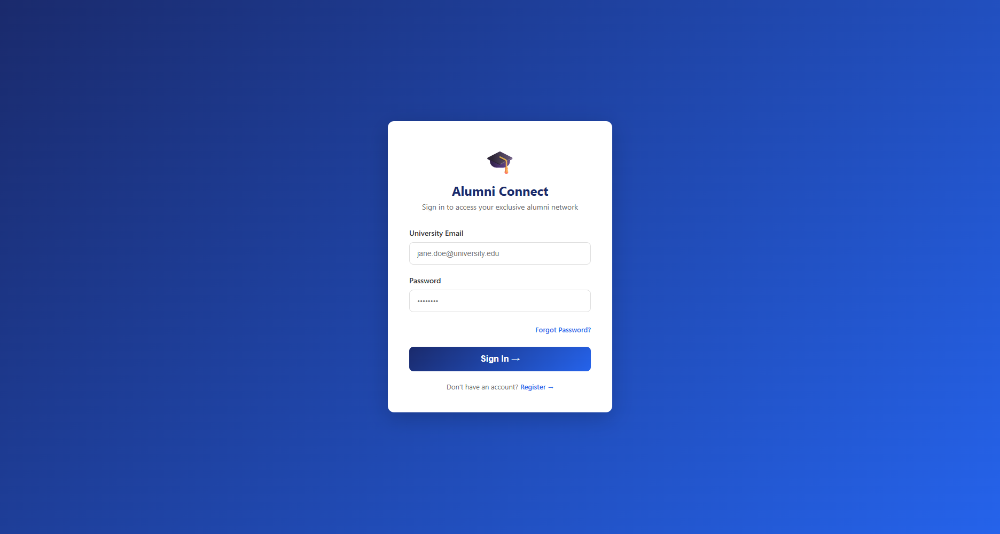

### 2. Event Details
Comprehensive event information including date, time, location, speakers, agenda, and pricing details.

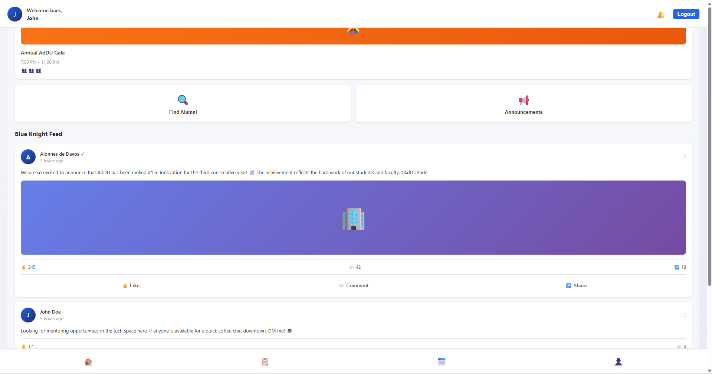

### 3. Event Confirmation
Registration confirmation page displaying ticket information and QR code for event check-in.

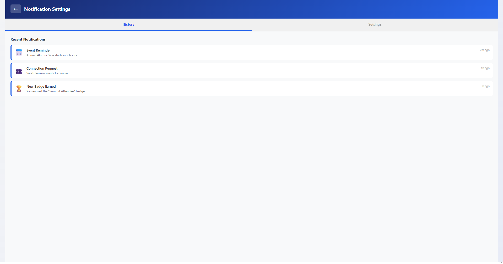

### 4. User Profile
Personal profile management showing alumni information, current position, location, and earned badges.

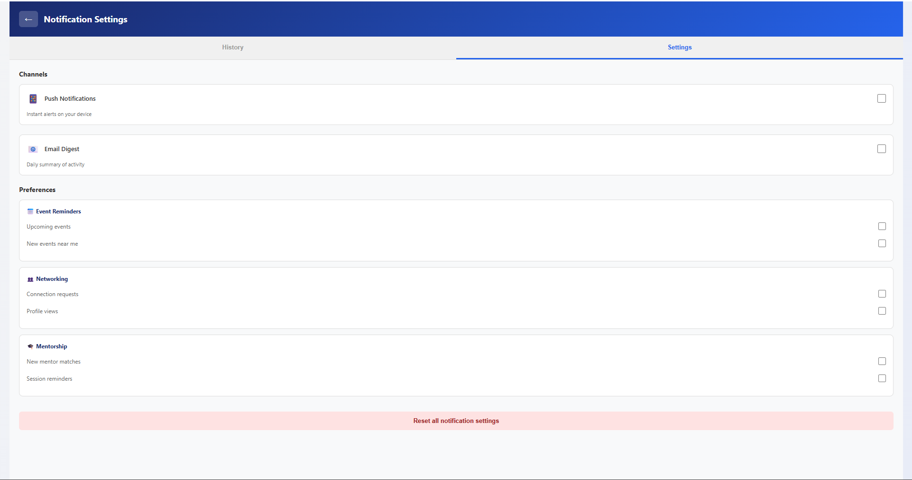

### 5. Admin Dashboard
Staff command center providing system analytics, active user counts, event revenue, and admin actions.

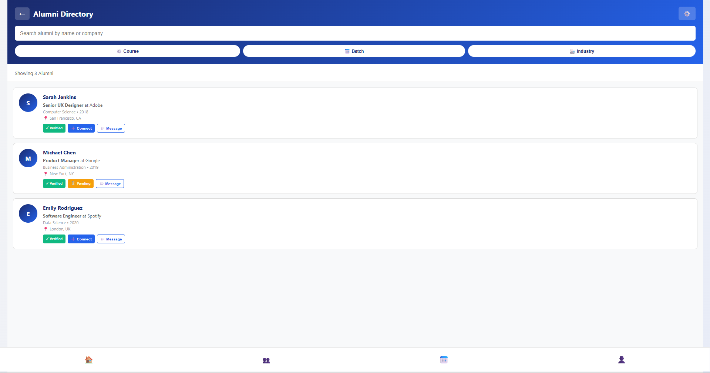

### 6. Verification Queue
Alumni verification management interface for admins to review and approve pending alumni registrations.

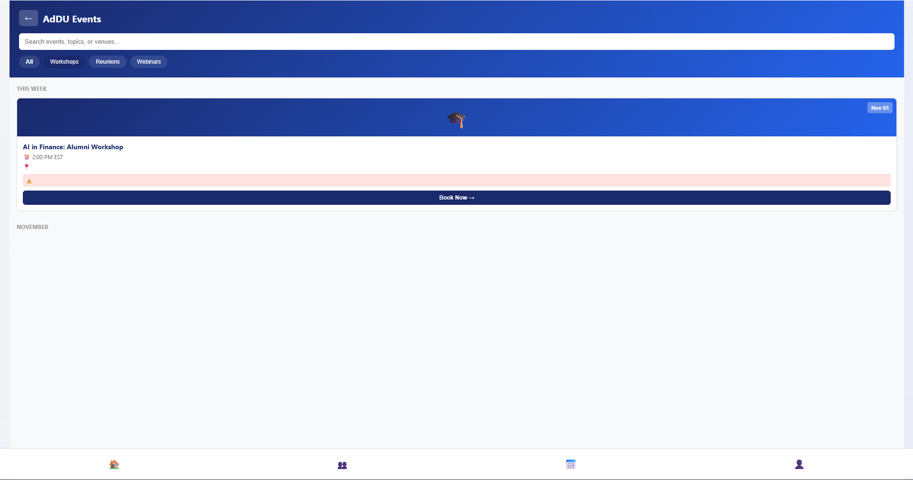

### 7. Create Event - Details
Multi-step event creation form allowing admins to input event title, date, time, category, and description.

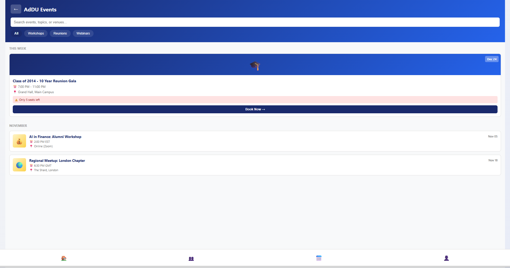

### 8. Create Event - Pricing
Event pricing configuration step for setting ticket prices and managing ticket types.

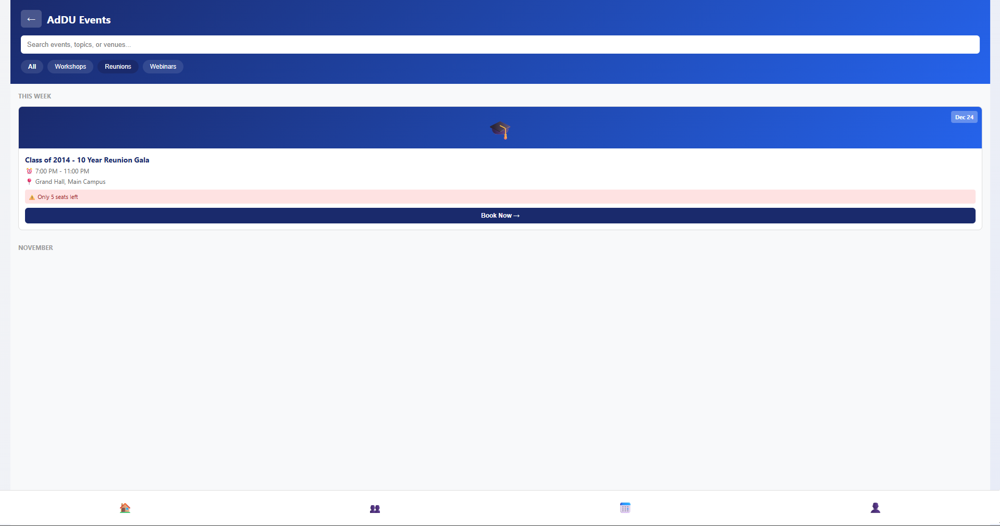

### 9. Create Event - Review
Final review step summarizing all event details before creation and publishing.

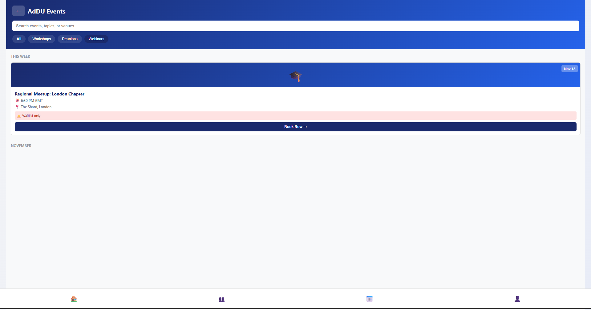

### 10. Event Analytics
Analytics and reporting dashboard showing event performance metrics including attendance rates and revenue.

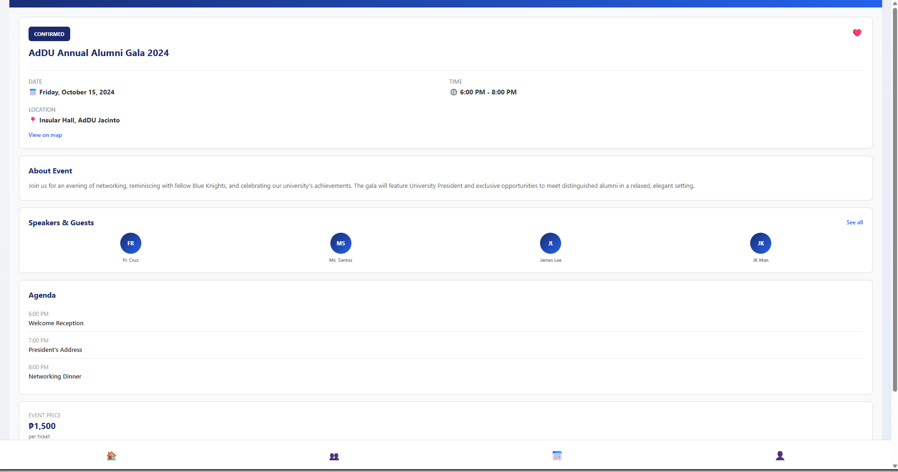

### 11. Invitation Builder
Tool for composing and sending event invitations to alumni groups with customizable messaging.

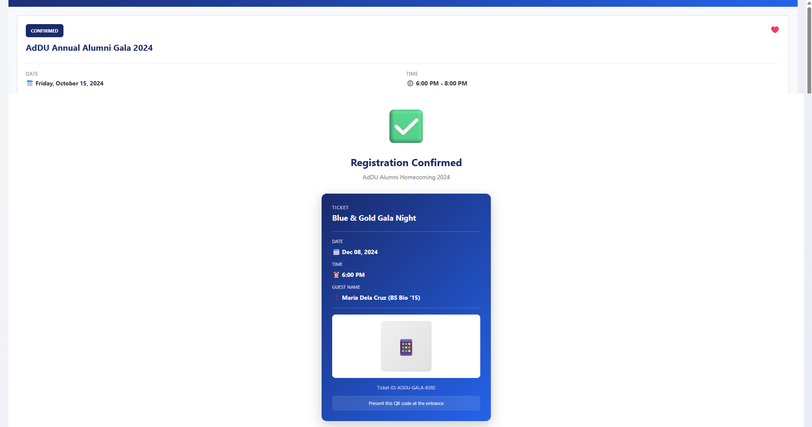

### 12. Dashboard
Main user dashboard with welcome greeting, quick action cards, and announcements feed.

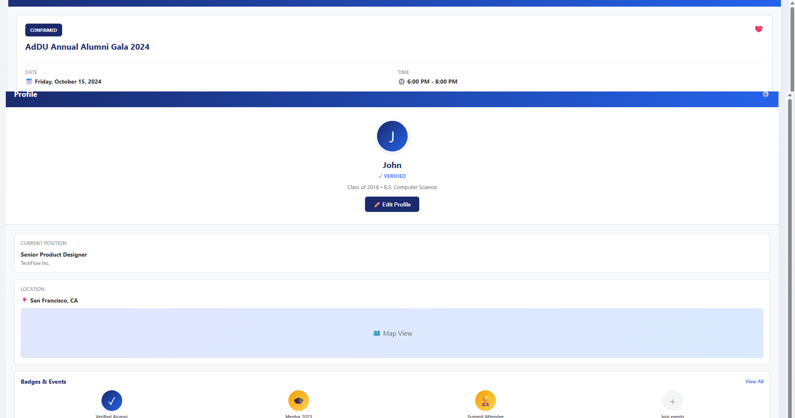

### 13. Notification Settings
User notification preferences interface for configuring channels and notification types.

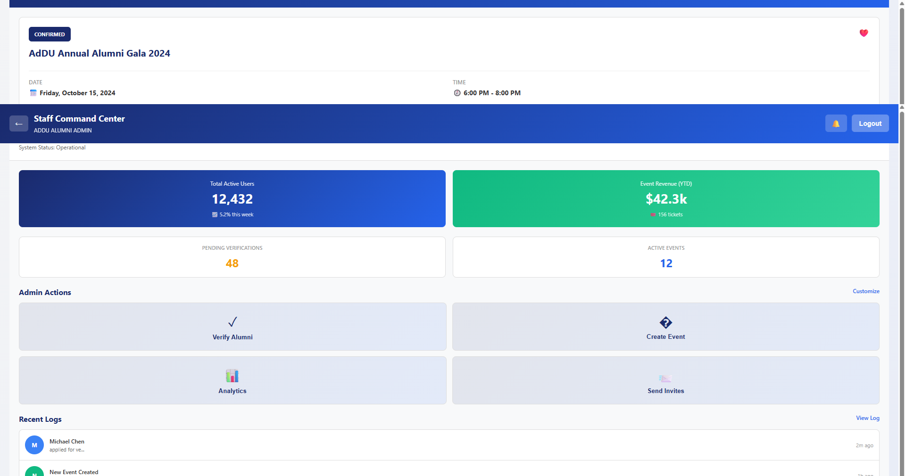

### 14. Alumni Directory
Searchable directory of alumni with filtering by course, batch, and industry.

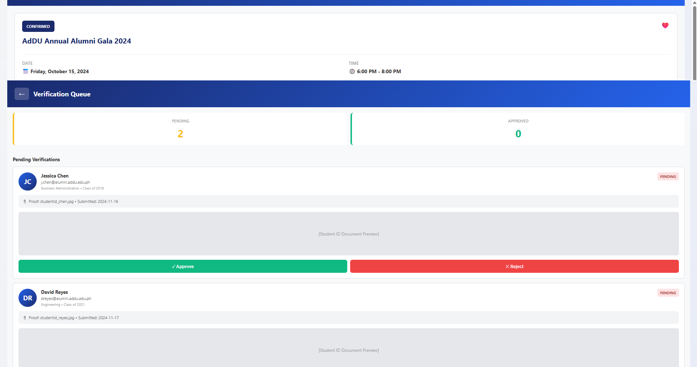

### 15. Event Management - Details Configuration
Interface for administrators to define core event information, including scheduling, categorical tagging, physical location, and capacity limits.

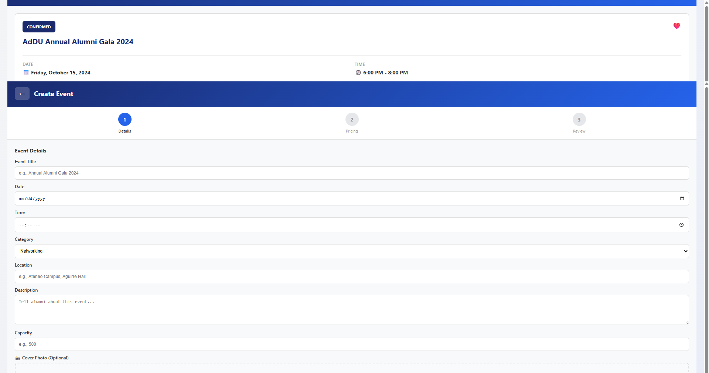

### 16. Event Management - Pricing Setup
Pricing configuration tool allowing event organizers to establish

### 17. Event Management - Final Review
Summary screen providing a complete overview of all configured event details and pricing parameters before official publication.

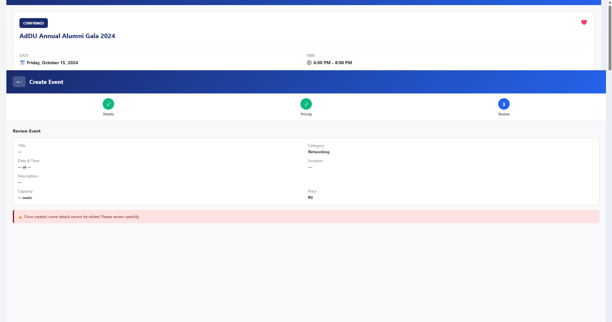

### 18. Comprehensive Event Analytics
Detailed performance dashboard displaying crucial metrics such as total attendees, check-in rates, generated revenue, average ratings, and historical attendance trends.

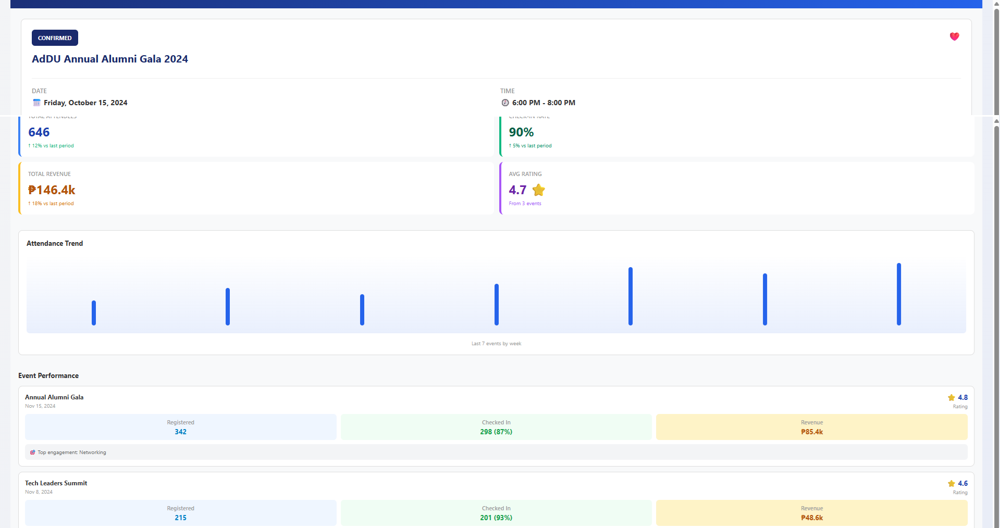

### 19. Invitation Builder - Recipient Selection
Targeted mailing tool enabling organizers to effortlessly select specific alumni segments (e.g., graduating batches or tech leaders) or manually add guests.

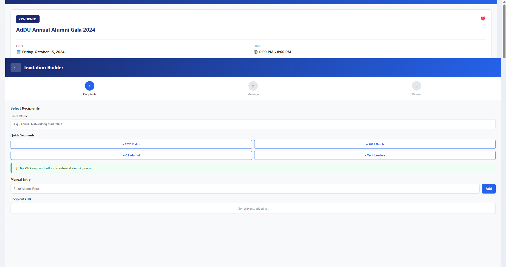

### 20. Invitation Builder - Message Composition
Email drafting interface for crafting customized event invitations, featuring subject line creation, message body formatting, and automatic registration link embedding.

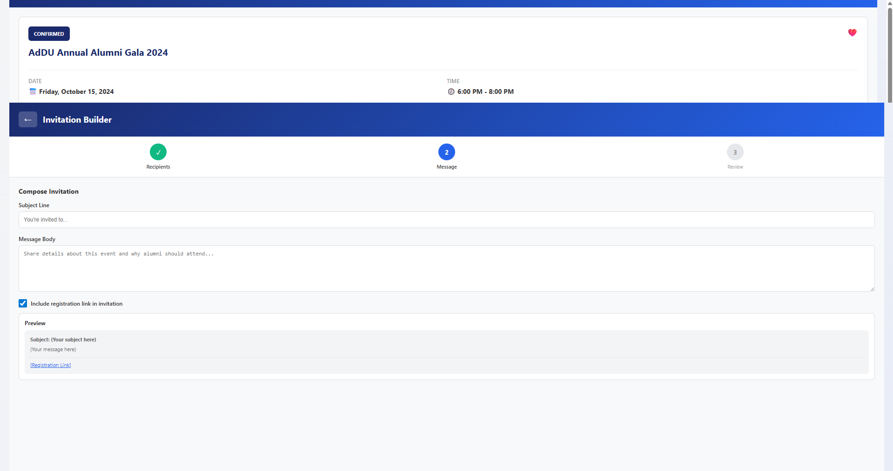

### 21. Invitation Builder - Review & Dispatch
Final verification screen for the invitation campaign, summarizing the recipient count and message details prior to dispatching emails to the alumni network.

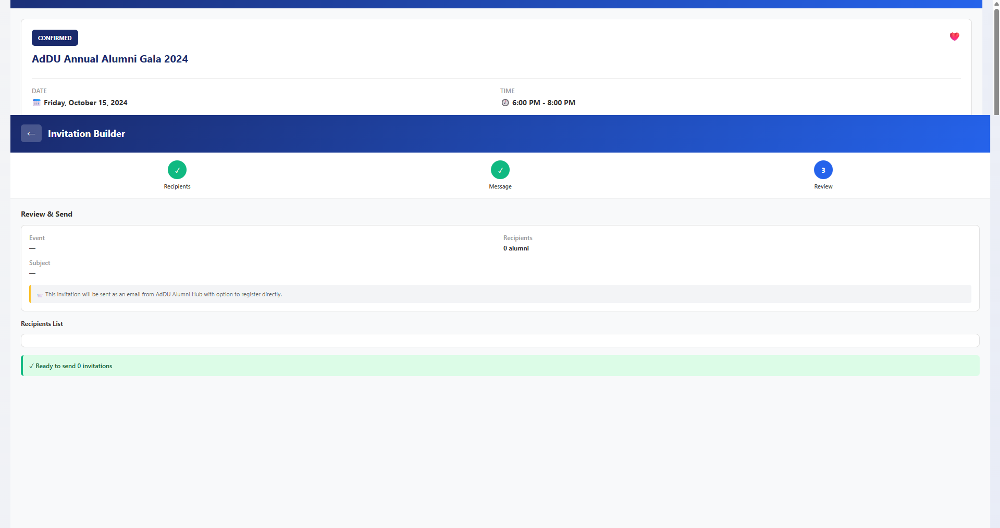

## Installation

### Prerequisites
Ensure you have the following installed:
- [Node.js LTS](https://nodejs.org/) (v18+)
- npm or yarn package manager
- Git

### Setup Steps

1. **Clone the Repository**
```bash
git clone <your-repo-link>
cd appdevvvvv
